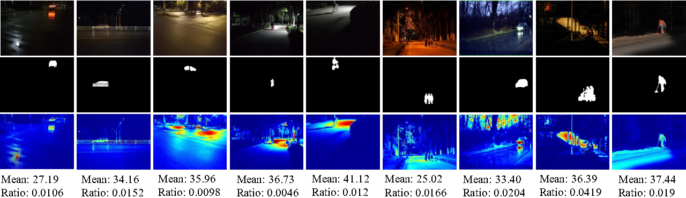

# LS-SOD
Official Implementation of "Low-Light Salient Object Detection Meets the Small Size"
- Since our paper is still under review, we will release our code and dataset once the paper is accepted. Thanks for your understanding.

## Low light Salient Pedestrian/Vehicle (LSPV) Dataset
- Recent years have witnessed rapid progress if Salient Object Detection (SOD). However, relatively few efforts have been dedicated to modeling salient object detection in low-light scenes with small pedestrians/vehicles. Furthermore, realistic applications of salient pedestrian/vehicle detection at long distances in low-light environments commonly exist in nighttime surveillance and nighttime autonomous driving. In particular, for autonomous driving at night, detecting pedestrians/vehicles with high reliability is paramount for safety. To fill the gap, we elaborately collect a new Low light Salient Pedestrian/Vehicle (LSPV) dataset, which consists of 3,100 low-light small pedestrian/vehicles images, and covers diverse challenging cases (e.g., low-light, non-uniform illumination environment, and small objects).

- Representative images and corresponding ground-truth masks in the LSPV dataset



## Prerequisites
- [Python 3.5](https://www.python.org/)
- [Pytorch 1.3.1](http://pytorch.org/)
- [OpenCV 4.4.0.42](https://opencv.org/)
- [Numpy 1.16.2](https://numpy.org/)
- [TensorboardX 2.1](https://github.com/lanpa/tensorboardX)
- [Apex](https://github.com/NVIDIA/apex)

## Download dataset
Download the following dataset and unzip them into `data` folder
We conduct experiments on our proposed LSPV-Test dataset and a widely used dataset, DUTS-TE.
- [DUTS-TE](https://drive.google.com/file/d/1HgIOSQkQX8W8A3JvOYD5LB7hSotvukOz/view?usp=sharing)
- Our proposed LSPV dataset will be available upon acceptance of our manuscript. Partial images and corresponding pixel-wise annotations from our constructed LSPV-Test can be downloaded on [Image](https://drive.google.com/file/d/1UbehK4CBaw9cwt_lv9u67jJWtAii5E-9/view?usp=drive_link) and [Mask](https://drive.google.com/file/d/1JuFSygBRJYWXs2ZEBwaEyjPGS8O22tok/view?usp=drive_link), respectively.

## Training
Training code will be available upon acceptance of our manuscript.

## Testing
Testing code will be available upon acceptance of our manuscript.

## Evaluation
```shell
cd eval
matlab
main
```

## Saliency maps
We provide prediction results of our proposed IEDNet model based on different backbones through SI, on the DUT-TE dataset.
| Model         | Backbone           | Test Set       |  Predictions  |
|---------------|----------------|-----------------|------------|
| IEDNet | ResNet | DUTS-TE | [DUT-TE](https://drive.google.com/file/d/1d5zSqUti2ubvhDOMUSZoNAP3a5MG4Fv_/view?usp=sharing) 
| IEDNet | Res2Net | DUTS-TE | [DUT-TE](https://drive.google.com/file/d/13Fp-c3mHX8sOw18NRyLTyUxvuzh6Oaj2/view?usp=sharing) 
| IEDNet |  PVTV2-1K | DUTS-TE | [DUT-TE](https://drive.google.com/file/d/1fggNZLdVLe3YKK3YiqS8hh3HnlN_cNHe/view?usp=sharing) 

Meanwhile, we provide the Mask2Former model trained on synthetic COCO (synthesized by our SI strategy).

| Model         | Backbone           | Train set       | Box AP | Config | CKPT |
|---------------|----------------|-----------------|------------|-----------------|------------|
| Mask2Former | ResNet50 | Syn COCO | 38.9 | [Config](https://drive.google.com/file/d/1pSHm0h84Qgj2gVD1FgDGQvfi4PxdoAKm/view?usp=sharing) |[CKPT](https://drive.google.com/file/d/1Hr71EfT_vUMpLkFqampevLbljBcNnsms/view?usp=sharing) 

- If you have any questions, please get in touch with wangshiqin@wust.edu.cn


